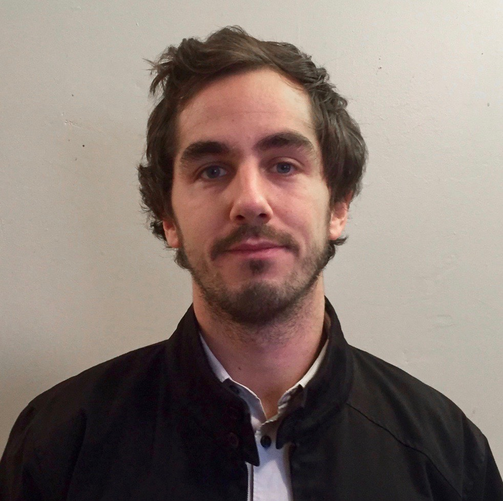

Tobia Marcucci is a sixth-year PhD student at the Massachusetts Institute of Technology (MIT), [Computer Science and Artificial Intelligence Laboratory (CSAIL)](https://www.csail.mit.edu), under the supervision of [Russ Tedrake](https://groups.csail.mit.edu/locomotion/russt.html) and [Pablo Parrilo](https://www.mit.edu/~parrilo/). During his PhD, Tobia has also spent one year at Stanford University as a graduate visiting researcher in [Stephen Boyd](https://web.stanford.edu/~boyd/)'s group. Before MIT, Tobia was at the University of Pisa, where he graduated cum laude in mechanical engineering and where he started a PhD in robotics at the [Research Center E. Piaggio](https://www.centropiaggio.unipi.it) and the [Istituto Italiano di Tecnologia (IIT)](https://www.iit.it/en-US/). His research lies at the intersection of convex and combinatorial optimization, with applications to robotics, motion planning, and optimal control.

CV available at: <a href="https://tobiamarcucci.github.io/marcucci_cv.pdf" target="_blank">https://tobiamarcucci.github.io/marcucci_cv.pdf</a>
